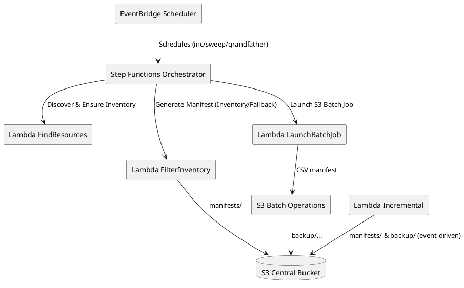

# Solución de Backups S3 – Documento Ejecutivo y Técnico

Este documento describe la solución de copias de seguridad sobre Amazon S3 implementada para la organización. Incluye visión ejecutiva, diseño técnico, operación, seguridad, costes y hoja de ruta. Está pensado para su presentación a dirección y para uso del equipo técnico.

---

## 1) Resumen Ejecutivo

- Un único bucket central de S3 consolida datos de backup, manifiestos y reportes, con rutas estandarizadas por criticidad, tipo y generación (GFS).
- Orquestación con EventBridge Scheduler (agendas por criticidad), Step Functions (descubrir → manifest → copiar) y Lambdas, utilizando S3 Inventory y S3 Batch Operations para escalar.
- RPO: Crítico 12h (incremental), Menos Crítico 24h (incremental). Full regulares (sweep) y “grandfather” para conservación prolongada.
- Ciclo de vida (GFS) por criticidad con transición automática a GLACIER_IR y luego a DEEP_ARCHIVE (cumpliendo la regla S3 de 90 días entre clases).
- Seguridad: cifrado, bloqueo público, política anti‑borrado opcional (breakglass + MFA). Object Lock descartado (no se activa versionado).

---

## 2) Objetivos

- Garantizar RPO ≤ 12h para datos críticos y ≤ 24h para menos críticos con backups incrementales.
- Reducir complejidad operativa y costes con un diseño de un solo bucket y políticas de ciclo de vida GFS.
- Cumplir buenas prácticas de seguridad y preparar la solución para auditoría y escalamiento.

---

## 3) Arquitectura (alto nivel)

```text
┌──────────────────────────────────────────────────────────────────────┐
│                  Cuenta Única – Región (AWS)                         │
│                                                                      │
│  +-------------------------+   Schedules (por criticidad)            │
│  | EventBridge Scheduler  |─── incremental / sweep / grandfather     │
│  +-------------------------+                                          │
│               │                                                       │
│               ▼                                                       │
│        +-------------+                                                │
│        | Step Fn.    |  FindResources → FilterInventory → Batch Job  │
│        | Orchestrator|                                                │
│        +-------------+                                                │
│     ┌─────────┴─────────┐                                            │
│     │                   │                                            │
│     ▼                   ▼                                            │
│ +----------+     +----------------+         +--------------------+    │
│ | Lambda   |     | Lambda         |  CSV →  | S3 Batch Operations|    │
│ | FindRes. |     | FilterInventory|────────►| (Copy)             |    │
│ +----------+     +----------------+         +--------------------+    │
│                              ▲                                   │    │
│                              │ S3 Inventory (Daily)              │    │
│              +-----------------------------------------+             │
│              |  S3 Bucket Central (único)              |             │
│              |-----------------------------------------|             │
│              | backup/criticality=…/backup_type=…/     |             │
│              |   generation=son|father|grandfather/…   |             │
│              | manifests/…/manifest.csv                |             │
│              | reports/…                                |             │
│              | checkpoints/<bucket>/<tipo>.txt         |             │
│              +-----------------------------------------+             │
│                                                                      │
│  +-------------------------+    SQS (eventos S3)                      │
│  | Lambda Incremental     |◄─────────────────────┐                    │
│  | (12h/24h ventanas)     |→ CSV → Batch (Copy)  │                    │
│  +-------------------------+                      │                    │
│                                                   └─ Buckets origen   │
└──────────────────────────────────────────────────────────────────────┘
```

Rutas de datos en el bucket central:

- Datos: `backup/criticality=<Critico|MenosCritico|NoCritico>/backup_type=<incremental|full>/generation=<son|father|grandfather>/...`
- Manifiestos: `manifests/.../manifest.csv`
- Reportes: `reports/criticality=.../backup_type=.../generation=.../...`
- Checkpoints: `checkpoints/<source-bucket>/<backup_type>.txt`

---

## 4) Planificación y RPO

- Incremental (≤24h):
  - Crítico: cada 12h.
  - Menos Crítico: cada 24h.
  - Prefijo: `backup_type=incremental`, `generation=son`.
- Full (sweep): semanal/quincenal según criticidad → `generation=father`.
- Full (grandfather): mensual/trimestral/semestral según criticidad → `generation=grandfather`.

Nota: La primera corrida incremental no se fuerza a full (respeta incremental). Si no hay S3 Inventory aún, se usa un fallback de ListObjectsV2 con límites opcionales.

---

## 5) Ciclo de Vida: GFS por Criticidad

- Son (incremental): transición inmediata a GLACIER_IR, expiración corta (p. ej., 21–45 días).
- Father (full): GLACIER_IR → DEEP_ARCHIVE (automático ≥90 días de offset) → expiración larga (p. ej., 1–5 años).
- Grandfather (full): GLACIER_IR → DEEP_ARCHIVE (≥90 días) → retención muy larga (p. ej., 5 años).

Validación S3: se fuerza el offset mínimo entre GLACIER_IR y DEEP_ARCHIVE (90 días), evitando errores 400.

---

## 6) Seguridad

- Cifrado: SSE (AES256) por defecto (KMS opcional).
- Bloqueo público: deshabilitado (Public Access Block).
- Anti‑borrado (opcional): “deny delete” con lista de ARNs breakglass y MFA requerido.
- Transporte seguro: (opcional) políticas que deniegan sin TLS y sin SSE en PUT.
- Object Lock: descartado en esta fase (no versionado). Puede incorporarse con recreación de bucket.

---

## 7) Operación

1) Despliegue Terraform:
   - `terraform -chdir=central-resources apply`
   - `terraform -chdir=initiative-logic apply`
2) Etiquetado de origen: `BackupEnabled=true`, `BackupCriticality=<Critico|MenosCritico|NoCritico>`.
3) Verificación:
   - Lifecycle: `aws s3api get-bucket-lifecycle-configuration --bucket <central-bucket>`.
   - Logs de Lambdas/Step Functions.
   - Reportes de S3 Batch en `reports/`.

---

## 8) Parámetros Clave (ejemplos)

- Schedules por criticidad (`initiative-logic/terraform.tfvars`):
  - `schedule_expressions = { Critico = { incremental="rate(12 hours)", sweep="rate(7 days)", grandfather="cron(...)" }, ... }`
- GFS por criticidad (`central-resources/variables.tf`):
  - `gfs_rules.Critico.enable=true` (igual para Menos/NoCritico), retenciones por generación.
  - `min_deep_archive_offset_days = 90` (regla S3 automatizada).
- Seguridad (opcional):
  - `deny_delete_enabled = true`, 
  - `allow_delete_principals = ["arn:aws:iam::<acct>:role/Breakglass"]`,
  - `require_mfa_for_delete = true`.

---

## 9) Costes (guía)

- GLACIER_IR inmediato para ventanas recientes de acceso raro con recuperación rápida.
- DEEP_ARCHIVE para retención de full a medio/largo plazo.
- Lifecycle por criticidad y generación reduce el coste total de propiedad.

---

## 10) Riesgos y Limitaciones

- Sin Object Lock/versionado: no WORM estricto. La policy “deny delete” mitiga, pero no sustituye Object Lock.
- S3 Inventory es Daily: la primera corrida incremental puede usar fallback (más costoso en grandes buckets). Se mitigó con límites opcionales.

---

## 11) Hoja de Ruta (opcional)

- DR: replicación cross‑region/cross‑account.
- Endurecer políticas: Deny sin TLS / sin SSE.
- Reportería KPI/SLA, tablero de cumplimiento y pruebas de restauración periódicas.

---

## 12) Apéndice – Diagrama PlantUML (opcional)



---

## 13) Archivos Relevantes

- `central-resources/main.tf` – bucket, lifecycle GFS, políticas.
- `central-resources/variables.tf` – parámetros GFS, seguridad y offset S3.
- `initiative-logic/main.tf` – orquestación, schedules, Lambdas.
- `initiative-logic/lambdas/*` – implementación Lambda.
- `README.md` y este documento.

---

## 14) KPIs / SLAs (ejemplos)

- Cumplimiento RPO por criticidad (% ejecuciones ≤RPO).
- Tiempos medios: generación de manifiesto, ejecución de Batch.
- Tasa de reintentos/fallos por componente.
- Coste mensual por clase/criticidad.

